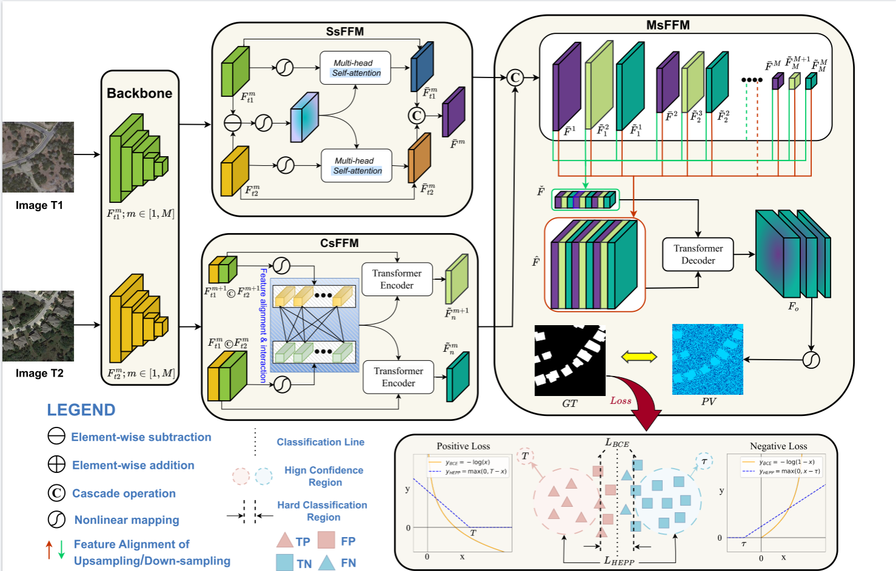

# RaHFF-Net: Recall-adjustable Hierarchical Feature Fusion Network for Remote Sensing Image Change Detection
Here, we provide the pytorch implementation of the paper: RaHFF-Net: Recall-adjustable Hierarchical Feature Fusion Network for Remote Sensing Image Change Detection.

For more ore information, please see our published paper at [IEEE TGRS](https://ieeexplore.ieee.org/document/9491802) or [arxiv](https://arxiv.org/abs/2103.00208). 



## Requirements

```
Python 3.6
pytorch 1.6.0
torchvision 0.7.0
einops  0.3.0
```

## Installation

Clone this repo:

```shell
git clone https://github.com/iceking111/RaHFF-Net.git
cd models
```


## Train

```python
python trainer.py
```


## Evaluate

```python
python evaluator.py
```


## Dataset Preparation

### Data structure

```
"""
Change detection data set with pixel-level binary labels；
├─A
├─B
└─label
"""
```

`A`: images of t1 phase;

`B`:images of t2 phase;

`label`: label maps;


### Data Download 

LEVIR-CD: https://justchenhao.github.io/LEVIR/

WHU-CD: https://study.rsgis.whu.edu.cn/pages/download/building_dataset.html

DSIFN-CD: https://github.com/GeoZcx/A-deeply-supervised-image-fusion-network-for-change-detection-in-remote-sensing-images/tree/master/dataset

## License

Code is released for non-commercial and research purposes **only**. For commercial purposes, please contact the authors.

## Citation

If you use this code for your research, please cite our paper:

```
@ARTICLE{10733986,
  author={Wang, Bin and Zhao, Kang and Xiao, Tong and Qin, Pinle and Zeng, Jianchao},
  journal={IEEE Journal of Selected Topics in Applied Earth Observations and Remote Sensing}, 
  title={RaHFF-Net: Recall-Adjustable Hierarchical Feature Fusion Network for Remote Sensing Image Change Detection}, 
  year={2025},
  volume={18},
  number={},
  pages={176-190},
  keywords={Feature extraction;Transformers;Semantics;Lighting;Data mining;Tensors;Correlation;Noise;Indexes;Adaptation models;Change detection (CD);hyperexpectation push pull (HEPP) loss;multiscale feature fusion;transformer},
  doi={10.1109/JSTARS.2024.3485687}}

```

