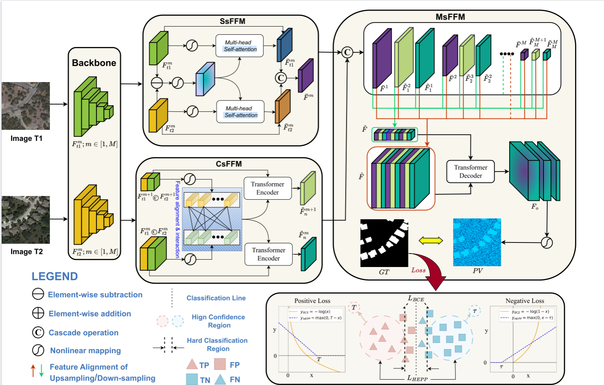

# RaHFF-Net: Recall-adjustable Hierarchical Feature Fusion Network for Remote Sensing Image Change Detection
Here, we provide the pytorch implementation of the paper: RaHFF-Net: Recall-adjustable Hierarchical Feature Fusion Network for Remote Sensing Image Change Detection.

For more ore information, please see our published paper at [IEEE TGRS](https://ieeexplore.ieee.org/document/9491802) or [arxiv](https://arxiv.org/abs/2103.00208). 



## Requirements

```
Python 3.6
pytorch 1.6.0
torchvision 0.7.0
einops  0.3.0
```

## Installation

Clone this repo:

```shell
git clone https://github.com/iceking111/RaHFF-Net.git
cd models
```

## Quick Start

We have some samples from the [LEVIR-CD](https://justchenhao.github.io/LEVIR/) dataset in the folder `samples` for a quick start.

Firstly, you can download our BIT pretrained model——by [baidu drive, code: 2lyz](https://pan.baidu.com/s/1HiXwpspl6odYQKda6pMuZQ) or [google drive](https://drive.google.com/file/d/1IVdF5a3e1_7DiSndtMkhpZuCSgDLLFcg/view?usp=sharing). After downloaded the pretrained model, you can put it in `checkpoints/BIT_LEVIR/`.

Then, run a demo to get started as follows:

```python
python model.py
```


## Train

```python
python trainer.py
```


## Evaluate

```python
python evaluator.py
```


## Dataset Preparation

### Data structure

```
"""
Change detection data set with pixel-level binary labels；
├─A
├─B
└─label
"""
```

`A`: images of t1 phase;

`B`:images of t2 phase;

`label`: label maps;


### Data Download 

LEVIR-CD: https://justchenhao.github.io/LEVIR/

WHU-CD: https://study.rsgis.whu.edu.cn/pages/download/building_dataset.html

DSIFN-CD: https://github.com/GeoZcx/A-deeply-supervised-image-fusion-network-for-change-detection-in-remote-sensing-images/tree/master/dataset

## License

Code is released for non-commercial and research purposes **only**. For commercial purposes, please contact the authors.

## Citation

If you use this code for your research, please cite our paper:

```
@Article{chen2021a,
    title={Remote Sensing Image Change Detection with Transformers},
    author={Hao Chen, Zipeng Qi and Zhenwei Shi},
    year={2021},
    journal={IEEE Transactions on Geoscience and Remote Sensing},
    volume={},
    number={},
    pages={1-14},
    doi={10.1109/TGRS.2021.3095166}
}
```

